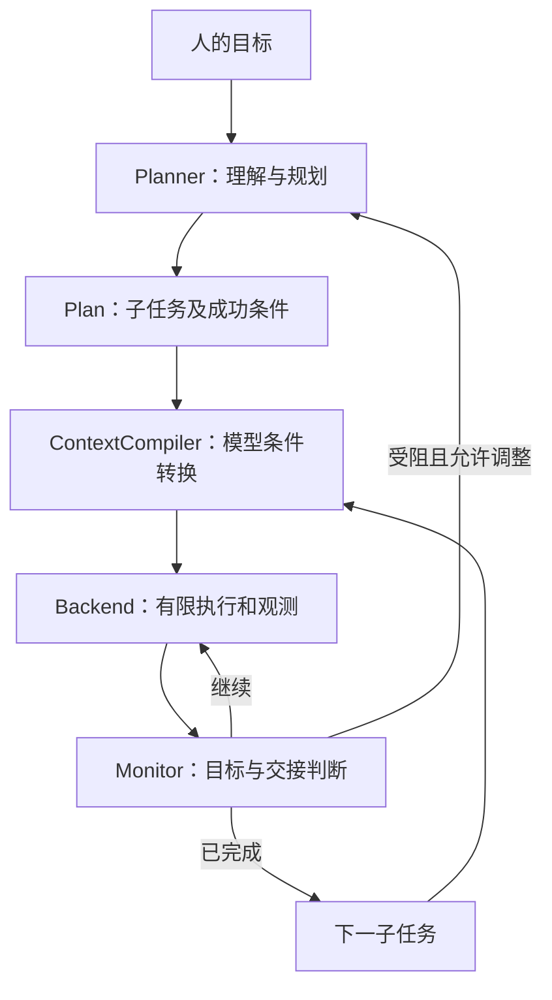

# AgenticWAM

面向动作模型的任务编排框架：理解人的目标，生成模型可执行的短条件，依据执行证据决定继续、切换或调整剩余计划。

**状态：0.4.0 工程预览。** 核心与任务、机器人、模型供应商分离；当前提供 Codex、Vela/OpenWAM 和离线证据回放适配。尚未通过真机泛化实验，也不宣称已形成新的研究方法。

## 五分钟离线体验

Python 3.10 及以上。从源码安装，不需要父仓库、GPU、机器人、模型账号或运行时第三方依赖：

```bash
git clone https://github.com/ZzzzzzHhhhhhh/AgenticWAM.git
cd AgenticWAM
python -m venv .venv
source .venv/bin/activate
python -m pip install .
agenticwam demo --scenario mixed --output agent-runs
agenticwam demo --scenario plates --output agent-runs
```

安装包名、命令和 Python 导入名统一为 `agenticwam`，例如 `from agenticwam.core import types`。
当前通过本仓库源码安装，尚未发布到 PyPI。已有安装请先阅读[迁移说明](docs/migration.md)。

`mixed` 依次演示放杯子、推方块、按按钮；`plates` 演示逐个摆盘。两者共用 Runner、文本编译器和条件检查器，只改变计划与证据数据。

示例使用预设事实回放，**不是物理仿真或机器人成功率测试**。它验证执行顺序、协议和模块替换。输出目录包含 `plan.json`、`events.jsonl` 和 `result.json`。将返回的目录传给 `agenticwam inspect` 可生成运行统计。

## 架构



| 目录 | 职责 | 内置实现 |
| --- | --- | --- |
| `core/` | 校验契约、顺序执行、取消、有限重规划、事件 | 只依赖 Python 标准库与 core |
| `planners/` | 模型调用与任务翻译 | Codex CLI、LanguagePlanner |
| `contexts/` | 把一个子任务转换为模型输入 | TextCompiler |
| `monitors/` | 判定目标进度与交接证据 | 可配置事件门控、视觉检查 |
| `backends/` | 动作模型/机器人服务适配 | Vela/OpenWAM HTTP、ReplayBackend |
| `examples/` | 具体任务与观测 | 摆盘、推物体、按按钮 |
| `service.py` | 单任务所有权、幂等请求、MCP | 通用 agent_* 工具 |
| `evaluation.py` | 统一事件统计 | 输出执行指标，不自动标注物理成功 |

OpenWAM 的上下文回执格式和 Vela 的夹爪信号配置只存在于适配层。核心不认识颜色、盘架、夹爪或特定模型。更换任务时改变目标、能力说明和证据规则；更换模型/设备时实现适配接口。

## 接入现有 Vela/OpenWAM

先按现有部署说明运行带任务上下文协议的 OpenWAM 服务与 Vela 控制台。本包只连接已有服务，不启动权重、不控制设备初始化。

Codex 适配器使用已安装、已登录的官方 CLI，保留当前实验采用的 `gpt-6-astra` 默认模型；可通过 `--model` 和 `--codex` 指定。它运行隔离的结构化推理调用，不执行模型生成的机器人控制代码。当前 Codex 子进程管理适配支持 Linux/macOS；核心和离线示例不依赖该适配。

```bash
agenticwam plan --profile src/agenticwam/examples/plates-openwam.json \
  --instruction '把盘子按照红黄蓝绿依次放进去' --output plans

# 执行命令会请求真实机器人运动；endpoint 使用部署控制台实际地址。
agenticwam run --profile src/agenticwam/examples/plates-openwam.json \
  --endpoint "$AGENTICWAM_CONSOLE_URL" --plan plans/PLAN_ID.json
```

此配置保持从里到外放置的模型能力边界。指定任意编号槽位、其他动作或未训练的能力需要相应模型支持。单步提示词是否落在训练分布内仍需实际验证。

当前使用文本输入与文本 context。`MediaRef` 预留图片/视频引用，但内置语言规划器会明确拒绝媒体请求；添加输入适配器后才能宣称多模态支持。

## 交互接口

```bash
python -m pip install '.[mcp]'
agenticwam mcp --profile src/agenticwam/examples/plates-openwam.json \
  --endpoint "$AGENTICWAM_CONSOLE_URL"
```

MCP 工具：`agent_capabilities`、`agent_plan`、`agent_execute`、`agent_status`、`agent_events`、`agent_cancel`。规划与查询不产生机器人运动。执行返回任务状态，重复相同 request_id 不会重复提交。同一进程只允许一个执行任务；取消后查询状态再提交下一个。幂等账本不跨进程持久化，重启不会自动恢复物理任务。

本项目统一使用 `agenticwam` 命令、`agenticwam` Python 包与 `agent_*` MCP 工具。Vela-Franka 是机器人执行后端的名称；旧版本的升级步骤见[迁移说明](docs/migration.md)。

## 扩展与验证

- [执行记忆与延迟优化](docs/latency.md)：有界上下文、合并确认、分段计时与只读对照实验。
- [接口和插件开发](docs/extensions.md)：Backend、Planner、Compiler、Monitor 契约与安装式插件。
- [评估与局限](docs/evaluation.md)：如何区分工程验证与真实泛化结果。
- [迁移说明](docs/migration.md)：v1 部署链路与 v2 独立框架之间的关系。

```bash
python -m pip install '.[dev,mcp]'
python -m pytest -q
python -m ruff check .
python -m ruff format --check .
```

本仓库包含构建配置、测试、示例、许可及贡献说明。`.github/workflows/ci.yml` 在 GitHub Actions 中检查安装、测试、打包和离线运行。

## 参考与许可

架构参考 [RPent](https://github.com/RLinf/RPent) 的规划器/工具/环境解耦与 [Pi](https://github.com/earendil-works/pi) 的运行循环边界；本目录没有复制它们的实现。
Codex 调用方式参见 [官方非交互模式文档](https://developers.openai.com/codex/noninteractive/)。

本目录的原创框架代码采用 Apache-2.0，见 LICENSE。该许可不改变父仓库、OpenWAM、第三方驱动、模型权重或数据集的许可。运行记录可能含相机画面与用户指令，默认保存在本地；发布代码时不附带实验记录。
